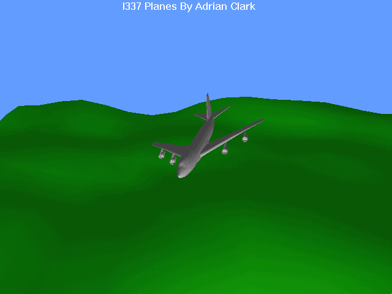



## Direct 3d Plane Simulation

### Description

This was just a little test program I wrote to see how hard it is to use Direct3D. Basically all you can do is load in a plane (there's 1 supplied), and then "fly" it round. It can rotate in X,Y and Z axis's (although rotating it too much sometimes stuffs the alignment up) and move it towards and away from camera.

The DX init code was used from one of the contest winners examples on this site, thanks to that person, but most of the rest is mine. If you have any comments please post them
 
### More Info
 

             |
---                |---
**Submitted On**   |2000-10-02 14:34:00
**By**             |[JimCamel](https://github.com/Planet-Source-Code/PSCIndex/blob/master/ByAuthor/jimcamel.md)
**Level**          |Intermediate
**User Rating**    |4.4 (40 globes from 9 users)
**Compatibility**  |VB 5\.0, VB 6\.0
**Category**       |[DirectX](https://github.com/Planet-Source-Code/PSCIndex/blob/master/ByCategory/directx__1-44.md)
**World**          |[Visual Basic](https://github.com/Planet-Source-Code/PSCIndex/blob/master/ByWorld/visual-basic.md)
**Archive File**   |[CODE\_UPLOAD103431012000\.zip](https://github.com/Planet-Source-Code/jimcamel-direct-3d-plane-simulation__1-11822/archive/master.zip)

